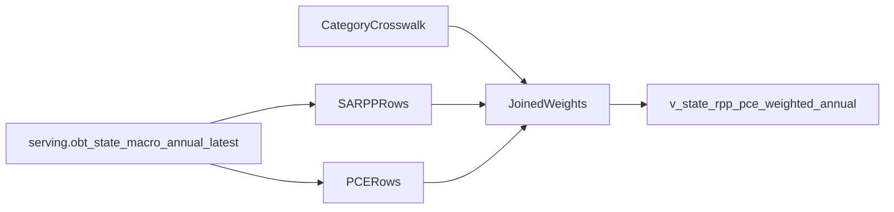

# Add Weighted RPP Serving View

## Goal

Add a new `serving` view that exposes annual state rows with `year`, `state`, `category`, `rpp`, `pce`, and `weighted_rpp`, where `weighted_rpp` is the contribution term `rpp * pce`. Consumers can then answer “what is the price level for this category across any subset of states?” by computing `sum(weighted_rpp) / sum(pce)`.

## Existing Foundation

Use the existing annual latest-vintage OBT in [src/macro_data_ingest/load/serving_views.py](/home/john/tlg/macro-data-ingest/src/macro_data_ingest/load/serving_views.py), which already exposes:

- `bea_table_name`
- `line_code`
- `series_code`
- `series_name`
- `function_name`
- `state_fips`, `state_abbrev`, `geo_name`
- `year`
- `pce_value`, `pce_value_scaled`

No load-pipeline wiring change should be needed, because [src/macro_data_ingest/load/pipeline.py](/home/john/tlg/macro-data-ingest/src/macro_data_ingest/load/pipeline.py) already recreates serving views after each load.

## Recommended Design

Create a new view in [src/macro_data_ingest/load/serving_views.py](/home/john/tlg/macro-data-ingest/src/macro_data_ingest/load/serving_views.py), for example `serving.v_state_rpp_pce_weighted_annual`, built from CTEs over `serving.obt_state_macro_annual_latest`.

Use this shape:

- `rpp_rows`: `bea_table_name = 'SARPP'`
- `pce_rows`: `bea_table_name IN ('SAPCE1', 'SAPCE4')`
- `category_crosswalk`: explicit mapping from each SARPP category to the PCE source series used as its weight
- final select: join `rpp_rows` to `category_crosswalk`, then to `pce_rows`, and compute `weighted_rpp = rpp * pce`

Suggested output columns:

- `year`
- `state_fips`
- `state_abbrev`
- `geo_name`
- `category`
- `rpp_line_code`
- `rpp_series_code`
- `rpp`
- `pce_source_table`
- `pce_series_code` or a lineage field showing which PCE rows fed the category
- `pce`
- `weighted_rpp`
- `vintage_tag` or separate RPP/PCE vintage fields if needed for auditability
- `mapping_method` so any approximate categories are explicit

## Mapping Strategy

Do not assume `SARPP.line_code = SAPCE4.line_code`.

The repo evidence suggests `SARPP` uses the compact RPP category set:

- `All items`
- `Goods`
- `Housing rents`
- `Utilities`
- `Other services`

The ingested PCE tables use different taxonomies:

- `SAPCE1` appears to be better for broad type aggregates like `Goods`
- `SAPCE4` appears to be a function hierarchy and is the likely source for finer buckets such as rent- and utility-related spending

Plan the crosswalk as an explicit SQL CTE or small maintained mapping block, with this decision order:

1. Prefer a direct BEA aggregate when the PCE taxonomy has a clearly matching category.
2. Use `SAPCE1` for broad aggregates like `All items`, `Goods`, and possibly `Other services` if a direct aggregate exists.
3. Use `SAPCE4` detail rollups for `Housing rents` and `Utilities` if those categories are only available as lower-level function lines.
4. If an exact rent/utilities split is not available from the ingested PCE series, document the approximation in `mapping_method` rather than hiding it.

Before implementation, audit the actual live line lists in the database for `SARPP`, `SAPCE1`, and `SAPCE4` and freeze the exact crosswalk from observed `series_code` / `function_name` values.

## Validation

Add coverage around the generated SQL and validate the view with database checks:

- one row per `year + state + category`
- no null `rpp` / `pce` for mapped categories
- `weighted_rpp = rpp * pce`
- `sum(weighted_rpp) / sum(pce)` across all states is approximately `100` for categories whose weights align with BEA’s national benchmark
- spot checks for known high-price states by category, such as housing rents and utilities

Add test coverage in a new or existing test file under [tests](/home/john/tlg/macro-data-ingest/tests).

## Usage Contract

Document the intended query pattern, for example:

```sql
SELECT
  year,
  category,
  SUM(weighted_rpp) / NULLIF(SUM(pce), 0) AS subset_price_level
FROM serving.v_state_rpp_pce_weighted_annual
WHERE state_abbrev <> 'CA'
GROUP BY year, category;
```

## Data Flow




